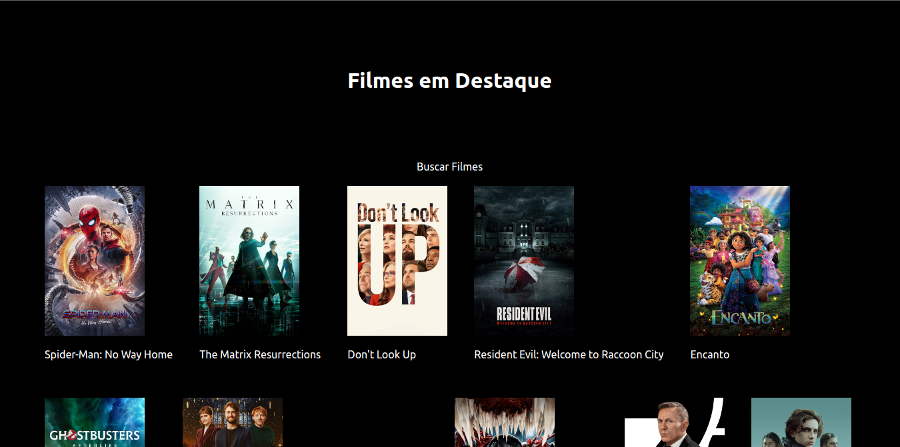

### Para ter o projeto em sua maquina basta:

```bash
git clone https://github.com/joaopaulo-D/cine-next.git
```
### Execute o projeto

```bash
npm run dev
# ou
yarn dev
```

### Telas 

#### Destaque


#### Descrição do Filme


<br>
<br>

### By João Paulo